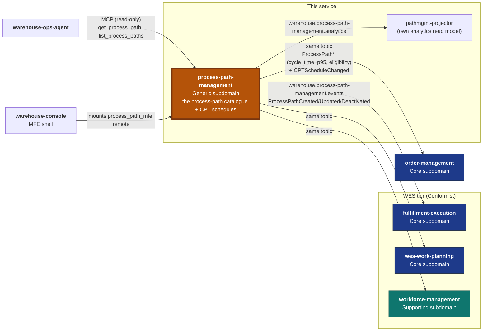

# Context Map

Process Path Management is the **Open Host Service / Published Language
source** for the `warehouse.process-path-management.events` topic. It has
**zero outbound dependency** on any other bounded context: it consumes no
other context's topic and makes no synchronous REST or MCP call to any
sibling. This is enforced in code by
`internal/architecture/fitness_test.go`'s
`TestNoSiblingContextOutboundCalls`, which fails the build if
`internal/adapters/outbound/**` ever imports `net/http`. Every edge below
points *away* from this service (it publishes) or *into* it (a sibling
reads it); none is a call this service makes.



## → `fulfillment-execution`, `wes-work-planning`, `workforce-management` (Conformist, live)

**Strategically: this context is the Open Host Service / Supplier; all
three are downstream Conformists.** Each previously boot-loaded the
process-path catalogue from a static YAML file
(`warehouse-infra/config/process-paths/sortable-fc.yaml`). The cutover to
this service's events was executed on 2026-09-06
([ADR 0002](/docs/adr/0002-yaml-to-kafka-cutover)): each consumer has an
`internal/adapters/outbound/kafkacatalog` package that replays this topic
into a local, in-memory catalogue using a per-process-unique consumer
group, selected with `PATH_CATALOGUE_SOURCE=kafka`. The consumers' own
binaries still default to `file`; `warehouse-infra` sets `kafka` (its
`deploy_process_path_kafka_source` variable defaults to `true`), and the
YAML file is kept only as the rollback payload.

These three consumers decode the `ProcessPath*` events only. None of them
reads `destination_location_role`
([ADR 0009](/docs/adr/0009-destination-location-role-on-process-path)),
`cycle_time_p95`/`eligibility`, or `CPTScheduleChanged` today.

## → `order-management` (Conformist, live)

`order-management` consumes the same topic with two separate consumers
(`internal/adapters/outbound/kafkacatalog` and
`internal/adapters/outbound/kafkacptschedule`), each with its own
per-process-unique consumer group, enabled by `PATH_CATALOGUE_SOURCE=kafka`
(its binary defaults to `none`; `warehouse-infra` sets `kafka`). The
catalogue consumer decodes each path's `cycle_time_p95` and `eligibility`;
the schedule consumer decodes `CPTScheduleChanged`. Together they are the
fulfillment capability contract of
[ADR 0010](/docs/adr/0010-fulfillment-capability-contract), from which
`order-management` derives its promise (its ADR 0014).

## ← `warehouse-ops-agent` (MCP, read-only)

`warehouse-ops-agent` calls this service's MCP server (`cmd/mcp`,
[ADR 0006](/docs/adr/0006-mcp-server-second-inbound-adapter)) via
`PROCESS_PATH_MANAGEMENT_MCP_ENDPOINT`, using the `get_process_path` and
`list_process_paths` tools. The MCP server also offers `get_cpt_schedule`
and, when `REPORTS_BASE_URL` is set, `get_catalogue_growth_report`. The
direction matters: the agent calls in; this service never calls the
agent.

## ← `warehouse-console` (micro-frontend)

The console shell mounts this repository's `web/` remote
(`process_path_mfe`) as the operator screen for defining, revising and
deactivating paths. The remote talks only to this service's own REST API
(through Kong at `/api/process-path-management` in the local cluster).

## Own analytics topic (not a sibling integration)

Every domain event is also published onto
`warehouse.process-path-management.analytics`
([ADR 0007](/docs/adr/0007-analytical-data-product)). The only consumer is
this service's own `pathmgmt-projector` (consumer group
`process-path-management-analytics`), which projects the "Process Path
Catalogue Growth & Change" report served by `pathmgmt-reports`. It
projects the three `ProcessPath*` event types and ignores
`CPTScheduleChanged`.

The envelope (identical CloudEvents-like shape across every
warehouse-systems publisher):

```json
{
  "event_id": "uuid-v4",
  "event_type": "ProcessPathCreated",
  "occurred_at": "2026-09-06T00:00:00Z",
  "source": "process-path-management",
  "data": {
    "path_id": "PICK",
    "match_prefix": "pick",
    "direct": true,
    "required_capabilities": ["pick"],
    "cycle_time_p95": "2h0m0s"
  }
}
```

See [apis/asyncapi.yaml](https://github.com/claudioed/process-path-management/blob/develop/apis/asyncapi.yaml)
for the full, per-event-type schema.

## Why this is Kafka-event-driven, not synchronous HTTP read-through

Every other cross-context integration in this fleet that resembles "context
A needs a fact that context B owns" is Kafka-driven, never a synchronous
hot-path call: `StockReserved`, `ShiftPlanCommitted`, and `TaskCompleted`
are all Kafka events consumed asynchronously, never RPC'd for on every
request. A synchronous read-through here (each consumer
calling this service's REST API on every `claimNext`/dispatch decision)
would put this Generic-subdomain service's availability on the hot path of
the consuming contexts' most latency-sensitive operations — exactly
the anti-pattern this fleet's other integrations already avoid. See
[ADR 0001](/docs/adr/0001-process-path-management-bounded-context) for the
full reasoning.

## Why this is a separate bounded context, not a package inside an existing one

No single existing context should own the process-path catalogue: it is
needed identically by three different services on both the WMS and WES
sides of the fleet, and none of them is a more natural owner than the
others. This is the same "extract generic logic instead of duplicating it"
argument `facility-layout` was built on for physical location structure —
see [ADR 0001](/docs/adr/0001-process-path-management-bounded-context) for
the full decision record, including the retired static-YAML predecessor
this service replaces.
