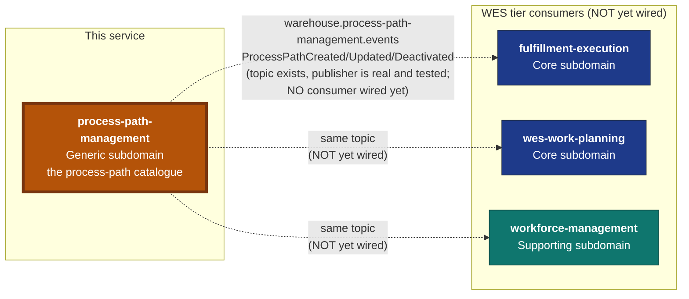

# Context Map

:::warning[Read this before the diagram]
`process-path-management` currently has **zero live integration** with any
other warehouse-systems service. It publishes ProcessPath domain events
onto Kafka when `EVENT_PUBLISHER=kafka`, but as of this document, **none**
of `fulfillment-execution`, `wes-work-planning`, or `workforce-management`
has a consumer wired to that topic. This is a separate, not-yet-done
follow-up PR in each of those three repos — it is documented here as a
real, honest gap, not implied to already be wired.
:::

Process Path Management has exactly **one** relationship in the fleet: it
is the **Open Host Service / Published Language source** for the
`warehouse.process-path-management.events` topic, with
`fulfillment-execution`, `wes-work-planning`, and `workforce-management` as
its intended (but not yet actual) **Conformist** consumers. It has **zero
inbound dependency** on any other service — this context is the SOURCE of
the process-path published language, never a consumer of anyone else's.



**Dashed edges are strategically real (the topic, the event shapes, the
publisher) but have no consumer wired to them yet.** Nothing in this
diagram is a solid, bidirectionally-live edge — unlike, say,
`labor-performance`'s live inbound consumption of
`fulfillment-execution`'s `TaskCompleted`.

## → `fulfillment-execution`, `wes-work-planning`, `workforce-management` (planned, not yet wired)

**Strategically: this context is the Open Host Service / Supplier; all
three are downstream Conformists.** Each of these three services
previously boot-loaded the process-path catalogue from a static YAML file
(`warehouse-infra/config/process-paths/sortable-fc.yaml`) at startup. This
service is designed to replace that file as their source of truth, but —
as of this document — **none of the three has actually built the Kafka
consumer that would complete that replacement.** They are, today, still
reading whatever static configuration they read before this service
existed; this service's publisher runs independently and its messages are,
for now, unconsumed.

Wiring each of those three consumers is explicitly **out of scope for this
service's own repository** — it is a separate, later PR in each of those
three repos, tracked as a known follow-up, not a silent gap.

The envelope (identical CloudEvents-like shape across every
warehouse-systems publisher):

```json
{
  "event_id": "uuid-v4",
  "event_type": "ProcessPathCreated",
  "occurred_at": "2026-09-06T00:00:00Z",
  "source": "process-path-management",
  "data": {
    "path_id": "PICK",
    "match_prefix": "pick",
    "direct": true,
    "required_capabilities": ["pick"]
  }
}
```

See [apis/asyncapi.yaml](https://github.com/claudioed/process-path-management/blob/develop/apis/asyncapi.yaml)
for the full, per-event-type schema.

## Why this is Kafka-event-driven, not synchronous HTTP read-through

Every other cross-context integration in this fleet that resembles "context
A needs a fact that context B owns" is Kafka-driven, never a synchronous
hot-path call: `StockReserved`, `ShiftPlanCommitted`, and `TaskCompleted`
are all Kafka events consumed asynchronously, never RPC'd for on every
request. A synchronous read-through here (each of the three consumers
calling this service's REST API on every `claimNext`/dispatch decision)
would put this Generic-subdomain service's availability on the hot path of
three Core-subdomain contexts' most latency-sensitive operations — exactly
the anti-pattern this fleet's other integrations already avoid. See
[ADR 0001](/docs/adr/0001-process-path-management-bounded-context) for the
full reasoning.

## Why this is a separate bounded context, not a package inside an existing one

No single existing context should own the process-path catalogue: it is
needed identically by three different services on both the WMS and WES
sides of the fleet, and none of them is a more natural owner than the
others. This is the same "extract generic logic instead of duplicating it"
argument `facility-layout` was built on for physical location structure —
see [ADR 0001](/docs/adr/0001-process-path-management-bounded-context) for
the full decision record, including the retired static-YAML predecessor
this service replaces.
