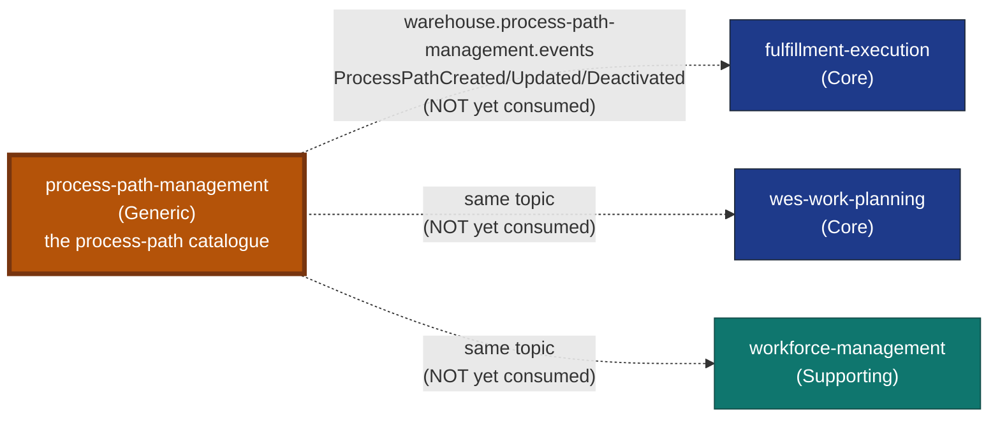

# Process Path Management

:::warning[Study project]
This documentation site is an educational Domain-Driven Design exercise. It
follows real industry-standard patterns and terminology, but it is **not a
production system** and is **not affiliated with, endorsed by, or
representative of Amazon, Manhattan Associates, Blue Yonder, or any other
company**.
:::

**Process Path Management** is the fleet's operator-configurable process-path
catalogue — a new bounded-context Go service in the `warehouse-systems`
fleet, alongside `order-management`, `inventory-storage`,
`wes-work-planning`, `workforce-management`, `fulfillment-execution`,
`facility-layout`, `warehouse-ops-agent`, and `labor-performance`.

## Why this context exists

Before this service existed, the process-path definition (a path's
canonical identity, the `matchPrefix` rule downstream consumers use to
resolve a caller-supplied id to a path family, and the capabilities a
station/associate must hold to work it) lived in a static YAML file —
`warehouse-infra/config/process-paths/sortable-fc.yaml` — loaded once at
boot by `fulfillment-execution`, `wes-work-planning`, and
`workforce-management`. A static, boot-time-only file cannot be revised
without a redeploy of every consumer, has no audit trail, and has no single
owner. This service replaces it with a real bounded context: an aggregate,
a REST API to define/revise/deactivate paths, and a Kafka-published
integration event so the change propagates without a synchronous call into
any consumer.

See [ADR 0001](/docs/adr/0001-process-path-management-bounded-context) for
the full decision record, including why this is Kafka-event-driven rather
than a synchronous HTTP read-through.

## What it owns

| Capability | What that means here |
| --- | --- |
| **ProcessPath** | The aggregate root: `PathId` (identity), `MatchPrefix`, `Direct`, `RequiredCapabilities`, `Status` (Active/Deactivated). |
| **Define / Revise / Deactivate** | The full lifecycle of a path definition, each publishing its own domain event. |
| **List / Get** | Read access for the operator SPA's default view (active-only) and audit view (`?all=true`). |

## What it deliberately does not own

- **Does not decide dispatch, routing, or task assignment.** This service
  defines WHAT a path is and WHICH capabilities it requires — it never
  claims, assigns, or completes work itself. That remains
  `fulfillment-execution`'s job.
- **Does not call any consumer synchronously.** Every change propagates
  exclusively via Kafka (`warehouse.process-path-management.events`). There
  is no REST dependency in either direction between this service and its
  three intended consumers.
- **Is not yet consumed by anyone.** As of this document, none of
  `fulfillment-execution`, `wes-work-planning`, or `workforce-management`
  has wired a consumer to this topic — see the
  [Context Map](/docs/ecosystem/context-map) for the full, honest picture.

## How it fits the fleet

Dashed edges mean the topic and event shapes are real and tested on this
service's own publisher side, but no consumer exists yet in the three
downstream repos — see the
[Context Map](/docs/ecosystem/context-map) for the full relationship
analysis.

## Where to go next

- **[Ubiquitous language](/docs/ddd/ubiquitous-language)** — ProcessPath,
  PathId, Capability, MatchPrefix, Direct, Status — pulled from the domain
  code's own doc comments.
- **[Aggregates & invariants](/docs/ddd/aggregates-and-invariants)** — the
  ProcessPath aggregate and its three invariants.
- **[Context map](/docs/ecosystem/context-map)** — this service's one real
  relationship (outbound-only, not yet consumed).
- **[API Reference](/docs/api-reference/rest/process-path-management-api)** — generated from the real,
  Spectral-linted `apis/openapi.yaml`.
- **[ADRs](/docs/adr)** — the consequential decisions, in Nygard format.
