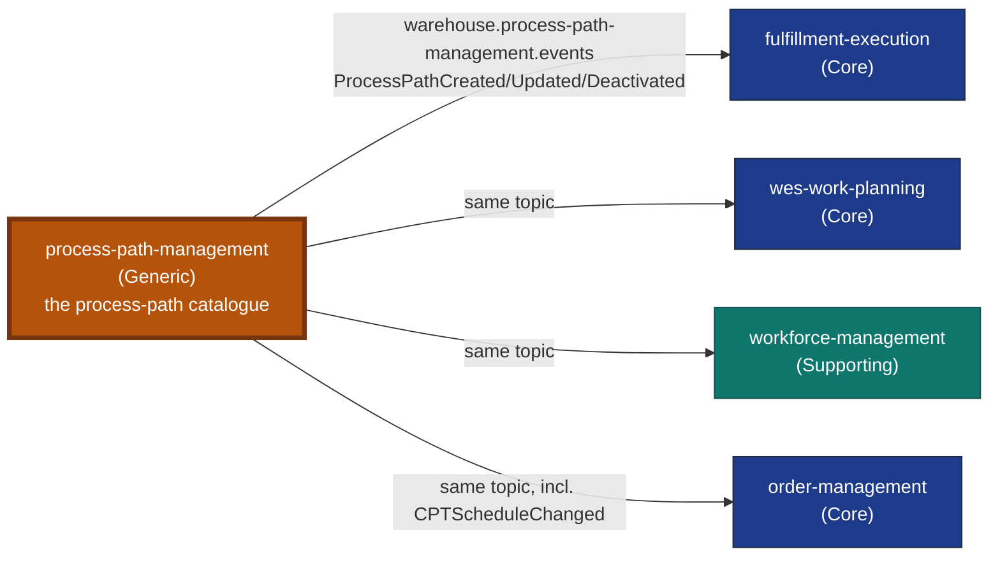

# Process Path Management

:::warning[Study project]
This documentation site is an educational Domain-Driven Design exercise. It
follows real industry-standard patterns and terminology, but it is **not a
production system** and is **not affiliated with, endorsed by, or
representative of Amazon, Manhattan Associates, Blue Yonder, or any other
company**.
:::

**Process Path Management** is the fleet's operator-configurable process-path
catalogue — a bounded-context Go service in the `warehouse-systems`
fleet, alongside `order-management`, `inventory-storage`,
`wes-work-planning`, `workforce-management`, `fulfillment-execution`,
`facility-layout`, `warehouse-ops-agent`, `labor-performance`, and
`network-fulfillment`.

## Why this context exists

Before this service existed, the process-path definition (a path's
canonical identity, the `matchPrefix` rule downstream consumers use to
resolve a caller-supplied id to a path family, and the capabilities a
station/associate must hold to work it) lived in a static YAML file —
`warehouse-infra/config/process-paths/sortable-fc.yaml` — loaded once at
boot by `fulfillment-execution`, `wes-work-planning`, and
`workforce-management`. A static, boot-time-only file cannot be revised
without a redeploy of every consumer, has no audit trail, and has no single
owner. This service replaces it with a real bounded context: an aggregate,
a REST API to define/revise/deactivate paths, and a Kafka-published
integration event so the change propagates without a synchronous call into
any consumer.

See [ADR 0001](/docs/adr/0001-process-path-management-bounded-context) for
the full decision record, including why this is Kafka-event-driven rather
than a synchronous HTTP read-through.

## What it owns

| Capability | What that means here |
| --- | --- |
| **ProcessPath** | The aggregate root: `PathId` (identity), `MatchPrefix`, `Direct`, `RequiredCapabilities`, optional `DestinationLocationRole` ([ADR 0009](/docs/adr/0009-destination-location-role-on-process-path)), `CycleTimeP95` and `Eligibility` ([ADR 0010](/docs/adr/0010-fulfillment-capability-contract)), `Status` (Active/Deactivated). |
| **Define / Revise / Deactivate** | The full lifecycle of a path definition, each publishing its own domain event. |
| **List / Get** | Read access for the operator SPA's default view (active-only) and audit view (`?all=true`). |
| **CPTSchedule** | A second aggregate, one per site: its timezone and recurring Critical Pull Time cutoffs, each naming the Active paths that can make it. Defined or wholesale-revised via `PUT /sites/{siteId}/cpt-schedule`; publishes `CPTScheduleChanged` ([ADR 0010](/docs/adr/0010-fulfillment-capability-contract)). |
| **Catalogue growth report** | An analytical read model (paths defined/revised/deactivated per day) built by `pathmgmt-projector` from this service's own analytics topic and served by `pathmgmt-reports` ([ADR 0007](/docs/adr/0007-analytical-data-product)). |

Four binaries ship from `cmd/`: `pathmgmt` (REST API on `:8080`, plus the
in-process outbox relay), `mcp` (read-only MCP server on `:8090`,
[ADR 0006](/docs/adr/0006-mcp-server-second-inbound-adapter)),
`pathmgmt-projector`, and `pathmgmt-reports` (`:8092`). Every REST route
and MCP tool is unauthenticated
([ADR 0005](/docs/adr/0005-remove-rest-auth)).

## What it deliberately does not own

- **Does not decide dispatch, routing, or task assignment.** This service
  defines WHAT a path is and WHICH capabilities it requires — it never
  claims, assigns, or completes work itself. That remains
  `fulfillment-execution`'s job.
- **Does not call any other context, synchronously or otherwise.** Every
  change propagates exclusively via Kafka
  (`warehouse.process-path-management.events`). There is no REST or MCP
  client to a sibling context in this codebase, and an architecture
  fitness test keeps it that way. Siblings may read *this* service (the
  ops agent over MCP); it never reads them.
- **Does not validate against other contexts' vocabularies.** Capability
  names, product attributes, site ids and destination location roles are
  carried as declared values, never looked up live.

## How it fits the fleet

All four consumers are live: the three WES-tier services replaced their
static YAML catalogue with this topic on 2026-09-06
([ADR 0002](/docs/adr/0002-yaml-to-kafka-cutover)), and
`order-management` reads path capability and CPT schedules from it
([ADR 0010](/docs/adr/0010-fulfillment-capability-contract)). See the
[Context Map](/docs/ecosystem/context-map) for each relationship,
including the MCP and micro-frontend edges.

## Where to go next

- **[Ubiquitous language](/docs/ddd/ubiquitous-language)** — ProcessPath,
  PathId, Capability, MatchPrefix, Direct, Status, CycleTimeP95,
  Eligibility, CPT schedule — pulled from the domain code's own doc
  comments.
- **[Aggregates & invariants](/docs/ddd/aggregates-and-invariants)** — the
  ProcessPath and CPTSchedule aggregates and their invariants.
- **[Context map](/docs/ecosystem/context-map)** — who consumes this
  service's events, who reads it over MCP, and why it calls no one.
- **[API Reference](/docs/api-reference/rest/process-path-management-api)** — generated from the real,
  Spectral-linted `apis/openapi.yaml`.
- **[ADRs](/docs/adr)** — the consequential decisions, in Nygard format.
